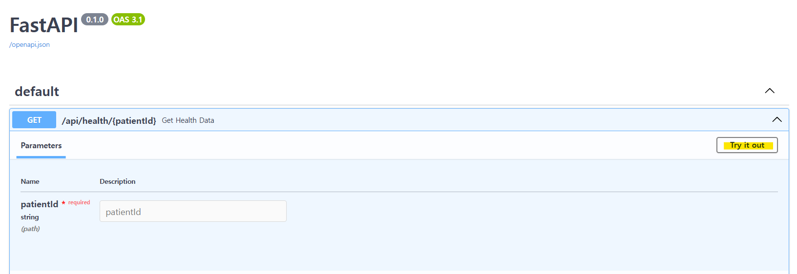
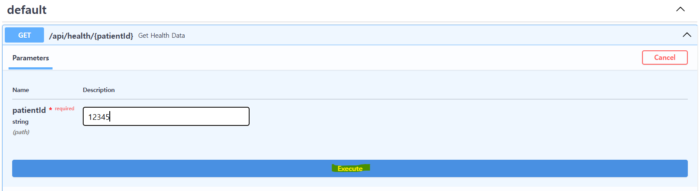
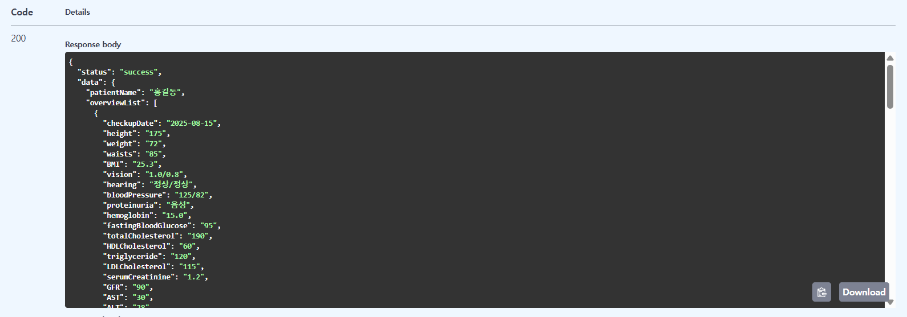
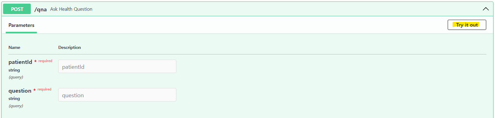
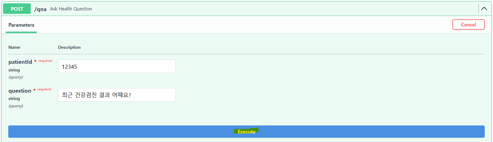
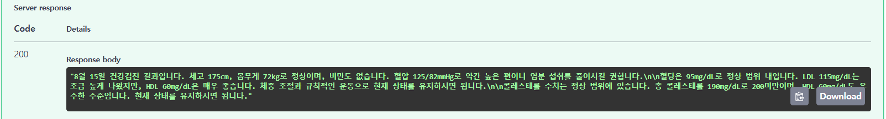

# Health Checkup AI Assistant

사용자의 건강검진 데이터를 분석하여 AI(Ollama)가 질문에 맞춰 답변하는 AI Assistant입니다.

## 필수 조건
- PC에 **Ollama**가 설치되어 있어야 합니다.

## 설치 및 실행 방법

1. **저장소 클론**
    - HTTPS 사용시:
   ```bash
   git clone https://github.com/Eunyoungkim0/health_checkup.git
   ```
   
   - SSH 사용시:
   ```bash
   git clone git@github.com:Eunyoungkim0/health_checkup.git
   ```
   
2. **Ollama 서버 실행**
    - 필요 시 모델 다운로드: ollama pull llama3.1:8b
   ```bash
   ollama serve
   ```

3. **FastAPI 서버 실행**
   ```bash
   uvicorn main:app --reload
   ```
   - main.py가 있는 디렉토리에서 실행
   - 브라우저에서 API 문서 확인: http://127.0.0.1:8001/docs

## 사용 방법
1. 건강검진 데이터 확인
   - GET /api/health/{patientID} 이용
   - 예시: 
     - patientID = "12345"
   - 데모(스크린샷):
     - 
     - 
     - 
2. AI Assistant 질문
   - POST /qna 이용
   - 예시: 
     - patientID = "12345"
     - question = "최근 건강검진 결과 어때요?"
   - 데모(스크린샷):
     - 
     - 
     - 